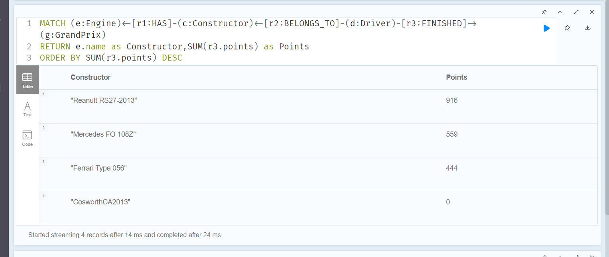
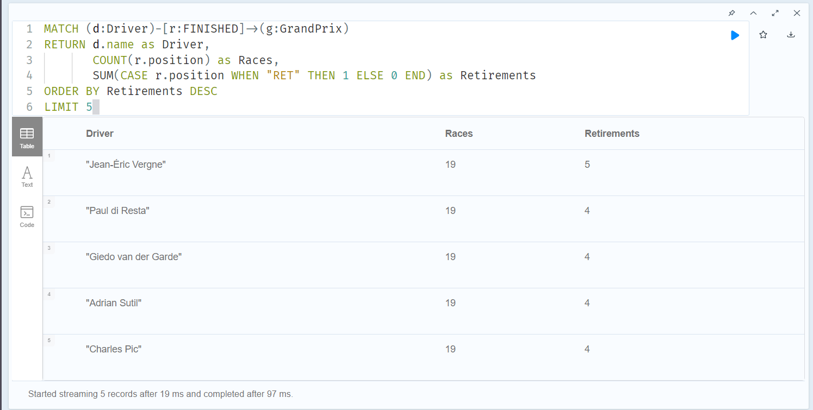
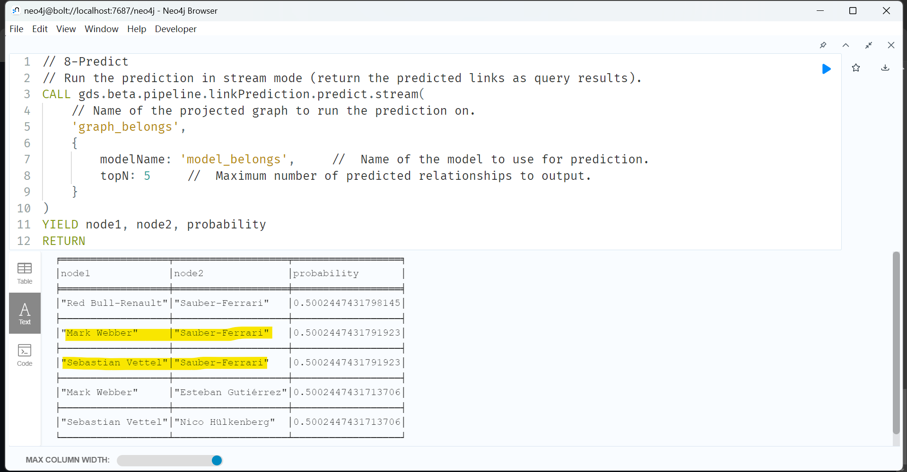

# BigData Project2 - Neo4j

A repo of Big Data Course's Project

---

- [BigData Project2 - Neo4j](#bigdata-project2---neo4j)
  - [Data Description](#data-description)
    - [Node](#node)
    - [Relationship](#relationship)
  - [Qeustions](#qeustions)

---

## Data Description

- Data Ref:
  - https://portal.graphgist.org/graph_gists/formula-1-2013-season/source

---

### Node

- `Driver`:

  - All of the **race drivers** for the last F1 season.
  - Property:
    - `name`
    - `born`

- `Country`:

  - All **countries** relevant to the graph, it could be from a **driver**, a **constructor** or a **Grand Prix**.
  - Property:
    - `name`

- `Constructor`:

  - The **constructor and team** for which a driver races will be refered to interchangeably in this graph.
  - Property:
    - `name`

- `Engine`:

  - All the **engines** used by the cars.
  - Property:
    - `name`

- `GrandPrix`:
  - All of the ones present this season, identified by the **city they take place in**.
  - Property:
    - `city`
    - `meters`

---

### Relationship

- `HAS`:

  - `Constructor`-->`Engine`

- `COUNTRY_ORIGIN`:

  - `Drivers`-->`Country`
  - `Constructor`-->`Country`
  - `GrandPrixs`-->`Country`

- `BELONGS_TO`:

  - `Drivers`-->`Constructor`
  - Properties:
    - `since`
    - `until`: Drivers--> OLD Constructor

- `Finished`:
  - `Drivers` --> `GrandPrix`.
  - Properties:
    - `position`
    - `points`

---

## Qeustions

- 0. DB creation

  - 0_creation.cypher

- 1. Which engine is the best? (Contribure most points)

- 2. Top 5 drivers who has the most retirement?

- 3. Based on the constructors' points, categorize all constructors into top-tier, mid-tier, and bottom-tier squads. (Unsupervised clustering)

- 4. Develop a logistic regression model to predict the presence of the 'belongs_to' relationship between a driver node and a constructor node.

- 5. Cluster the drivers based on their year of birth, using Python.
